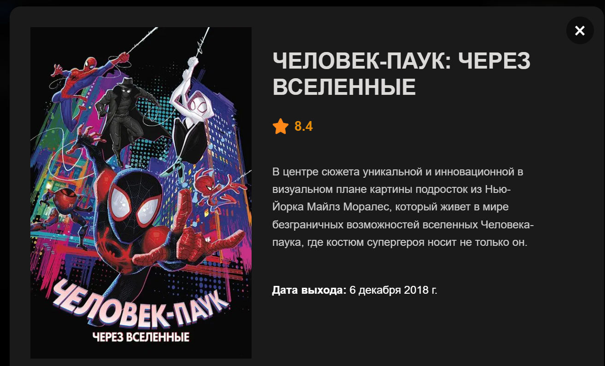
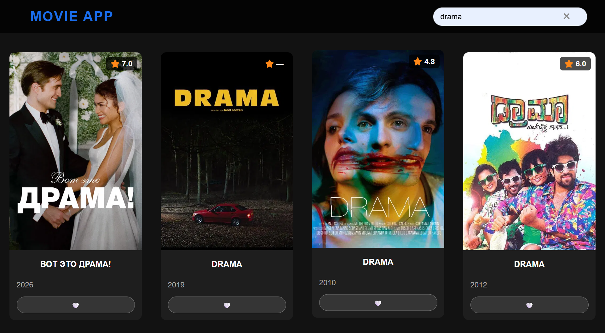

# 🎬 Movie Search App (React + Vite)

Modern React application for searching movies using TMDB API.  
Built with focus on UI/UX, performance and clean architecture.

🔗 **Live Demo:** https://marygeraska.github.io/movie-app-react/

## Preview

  
  



## Features

- Debounced search (optimized API requests)
- Modal with keyboard support (Esc)
- Pagination
- Skeleton loading
- Favorites with localStorage
- Responsive design
- Clean architecture using React hooks


## Tech Stack

- React (Hooks)
- Vite
- Axios
- CSS (Flexbox, Grid, Animations)
- TMDB API


## What I learned

- Working with REST API (TMDB)
- Managing state with React hooks
- Improving UX (debounce, modal behavior)
- Structuring components


## Setup

1. **Clone the repository**:
```bash
git clone https://github.com/marygeraska/movie-app-react.git
```

2. **Go to the project folder:**
    ```bash
    cd movie-app-react
    ```
3. **Install dependencies:**
    ```bash
    npm install
    ```
4. **Create .env.local and add your API key:**
    ```env
    VITE_TMDB_API_KEY=your_key_here
    ```
5. **Run the project:**
    ```bash
    npm run dev
    ```
##  Note

This project is for educational purposes and uses TMDB API.

## 🇷🇺 Краткое описание (RU)

Веб-приложение для поиска фильмов с использованием API TMDB.

Основной функционал:
- поиск фильмов с задержкой (debounce)
- модальное окно с подробной информацией
- добавление в избранное (localStorage)
- пагинация
- skeleton-загрузка
- адаптивный интерфейс

Проект создан с упором на чистую архитектуру, удобный пользовательский опыт и работу с API.